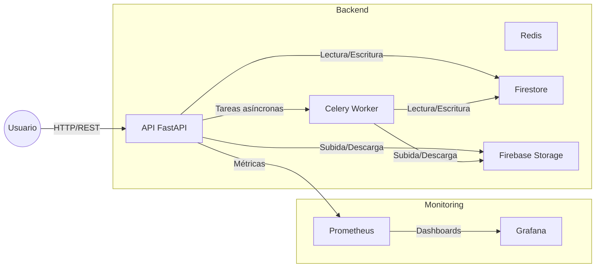

# Padelyzer Backend

Backend API para la aplicación Padelyzer, un sistema de análisis biomecánico para pádel que utiliza inteligencia artificial para mejorar el rendimiento de los jugadores.

## Características

- Análisis biomecánico de videos de pádel
- Cálculo de Padel IQ y métricas de rendimiento
- Sistema de matchmaking basado en niveles
- Autenticación con Firebase
- Almacenamiento de videos en Firebase Storage
- Base de datos en Firestore

## Requisitos

- Python 3.8+
- Firebase project
- Redis (para tareas asíncronas)
- OpenCV
- MediaPipe
- TensorFlow

## Instalación

El proyecto utiliza múltiples archivos de requisitos para separar las dependencias según su propósito:

1. `requirements.txt`: Dependencias principales del proyecto
   ```bash
   pip install -r requirements.txt
   ```

2. `requirements-dev.txt`: Dependencias para desarrollo y testing
   ```bash
   pip install -r requirements-dev.txt
   ```

3. `requirements-ml.txt`: Dependencias específicas para machine learning
   ```bash
   pip install -r requirements-ml.txt
   ```

Para instalar todas las dependencias:
```bash
pip install -r requirements.txt -r requirements-dev.txt -r requirements-ml.txt
```

## Estructura de Dependencias

### Dependencias Principales (`requirements.txt`)
- API y Framework (FastAPI, Uvicorn, etc.)
- Autenticación y Seguridad
- Base de Datos y Caché
- Procesamiento de Archivos
- Utilidades

### Dependencias de Desarrollo (`requirements-dev.txt`)
- Testing (pytest y plugins)
- Linting y Formateo (black, isort, flake8, mypy)
- Documentación (mkdocs)
- Herramientas de Desarrollo (ipython, jupyter)

### Dependencias de Machine Learning (`requirements-ml.txt`)
- Deep Learning (TensorFlow, PyTorch)
- Computer Vision (OpenCV, MediaPipe, YOLO)
- Procesamiento de Datos
- Optimización (ONNX, TensorRT)
- Utilidades de Visualización

## Configuración

1. Crear un proyecto en Firebase Console
2. Obtener las credenciales de servicio
3. Configurar las variables de entorno en `.env`:
```bash
cp .env.example .env
# Editar .env con tus credenciales de Firebase
```

## Uso

1. Iniciar el servidor:
```bash
uvicorn main:app --reload
```

2. Acceder a la documentación API:
```
http://localhost:8000/docs
```

## Estructura del Proyecto

```
padelyzer-backend/
├── app/
│   ├── api/
│   │   └── v1/
│   │       └── endpoints/
│   ├── core/
│   ├── schemas/
│   └── services/
├── routes/
│   └── padel_iq/
├── tests/
├── .env.example
├── main.py
└── requirements.txt
```

## Endpoints Principales

- `POST /api/calculate_padel_iq`: Calcula métricas de Padel IQ
- `POST /analyze/training`: Analiza video de entrenamiento
- `POST /analyze/game`: Analiza video de juego
- `GET /status/{task_id}`: Consulta estado del análisis
- `GET /history/{user_id}`: Obtiene historial de análisis

## Ejemplos de uso de endpoints principales

### 1. Registro de usuario
**POST** `/api/auth/register`

**Request:**
```json
{
  "email": "usuario@ejemplo.com",
  "password": "Password123!",
  "full_name": "Nombre Apellido",
  "name": "Nombre de usuario",
  "nivel": "intermedio",
  "posicion_preferida": "derecha"
}
```

**Response:**
```json
{
  "access_token": "<jwt_token>",
  "token_type": "bearer",
  "user": {
    "uid": "uid123",
    "email": "usuario@ejemplo.com",
    "display_name": "Nombre de usuario",
    "photo_url": null
  }
}
```

---

### 2. Login
**POST** `/api/auth/login`

**Request:**
```json
{
  "email": "usuario@ejemplo.com",
  "password": "Password123!"
}
```

**Response:**
```json
{
  "access_token": "jwt_token_aqui",
  "token_type": "bearer"
}
```

---

### 3. Obtener perfil del usuario actual
**GET** `/api/users/me`  
**Headers:** `Authorization: Bearer <access_token>`

**Response:**
```json
{
  "id": "uid123",
  "name": "Nombre de usuario",
  "nivel": "intermedio",
  "posicion_preferida": "derecha",
  "fecha_registro": "2024-06-01T12:00:00Z",
  "ultimo_analisis": "2024-06-01T13:00:00Z",
  "tipo_ultimo_analisis": "entrenamiento",
  "estadisticas": {
    "padel_iq": 87,
    "win_rate": 0.65
  }
}
```

---

### 4. Subir video para análisis
**POST** `/api/v1/video/upload`  
**Headers:** `Authorization: Bearer <access_token>`  
**Content-Type:** `multipart/form-data`

**Request (form-data):**
- `file`: (archivo de video)
- `video_type`: `training` | `game` | `torneo`
- `description`: (opcional)
- `player_position`: (opcional, JSON string)

**Response:**
```json
{
  "video_id": "video_abc123",
  "url": "https://firebasestorage.googleapis.com/v0/b/...",
  "status": "pending",
  "created_at": "2024-06-01T13:05:00Z",
  "message": "Video uploaded successfully"
}
```

---

### 5. Consultar estado y resultado de análisis de video
**GET** `/api/v1/video/analysis/{video_id}`  
**Headers:** `Authorization: Bearer <access_token>`

**Response:**
```json
{
  "video_id": "video_abc123",
  "url": "https://firebasestorage.googleapis.com/v0/b/...",
  "status": "completed",
  "created_at": "2024-06-01T13:05:00Z",
  "message": "Análisis encontrado",
  "padel_iq": 87,
  "metrics": {
    "accuracy": 0.92,
    "rally_length": 12,
    "serve_effectiveness": 0.8
  }
}
```

---

### 6. Consultar historial de análisis
**GET** `/api/v1/video/history/{user_id}`  
**Headers:** `Authorization: Bearer <access_token>`

**Response:**
```json
[
  {
    "video_id": "video_abc123",
    "status": "completed",
    "created_at": "2024-06-01T13:05:00Z",
    "padel_iq": 87
  },
  {
    "video_id": "video_def456",
    "status": "processing",
    "created_at": "2024-06-02T10:00:00Z"
  }
]
```

## Autenticación y gestión de sesiones

### Flujo general

- **Registro:** El usuario se registra y se inicia sesión automáticamente.
- **Login:** El usuario inicia sesión y se genera una sesión registrada en Firestore.
- **Recuperación de contraseña:** El usuario puede solicitar un enlace de recuperación y restablecer su contraseña.
- **Gestión de sesiones:** Cada login crea una sesión única. Se pueden listar y cerrar todas las sesiones activas.

### Endpoints y ejemplos

#### 1. Registro de usuario
**POST** `/api/v1/auth/register`
```json
{
  "email": "usuario@ejemplo.com",
  "password": "Password123!",
  "full_name": "Nombre Apellido",
  "name": "nombreusuario"
}
```
**Response:**
```json
{
  "access_token": "<jwt>",
  "token_type": "bearer",
  "user": {
    "uid": "...",
    "email": "usuario@ejemplo.com",
    "display_name": "nombreusuario",
    "photo_url": null
  }
}
```

#### 2. Login
**POST** `/api/v1/auth/login`
```json
{
  "email": "usuario@ejemplo.com",
  "password": "Password123!"
}
```
**Response:** igual al registro.

#### 3. Recuperación de contraseña
**POST** `/api/v1/auth/forgot-password`
```json
{
  "email": "usuario@ejemplo.com"
}
```
**Response:**
```json
{
  "message": "Si el email existe, se ha enviado un enlace de recuperación"
}
```

**POST** `/api/v1/auth/reset-password`
```json
{
  "token": "<token_recibido_por_email>",
  "new_password": "NuevaPassword123!"
}
```
**Response:**
```json
{
  "message": "Contraseña actualizada correctamente"
}
```

#### 4. Listar sesiones activas
**GET** `/api/v1/auth/sessions`
**Headers:**
```
Authorization: Bearer <access_token>
```
**Response:**
```json
{
  "active_sessions": [
    {
      "created_at": "2025-05-27T01:40:43.113002+00:00",
      "session_id": "...",
      "user_agent": "TestAgent/1.0",
      "is_active": true,
      "ip": "127.0.0.1",
      "user_id": "...",
      "last_active": "2025-05-27T01:40:43.113002+00:00"
    }
  ]
}
```

#### 5. Logout global (cerrar todas las sesiones)
**POST** `/api/v1/auth/logout-all`
**Headers:**
```
Authorization: Bearer <access_token>
```
**Response:**
```json
{
  "message": "N sesiones cerradas correctamente"
}
```

### Seguridad y manejo de sesiones
- Los tokens JWT se validan en cada endpoint protegido.
- Cada sesión se registra en Firestore con user_id, session_id, timestamps, IP y user-agent.
- El logout global marca todas las sesiones como inactivas.
- La recuperación de contraseña requiere token único y expira en 1 hora.
- La política de contraseñas exige mínimo 8 caracteres, mayúscula, minúscula, número y símbolo.

## Testing

```bash
pytest
```

## Pruebas y Calidad

### Cómo ejecutar los tests

```bash
# Ejecutar todos los tests
printfest

# Ejecutar tests de un archivo específico
pytest tests/test_nombre.py

# Ver resultados detallados
pytest -v

# Ver solo fallos y advertencias
pytest --maxfail=3 --disable-warnings -q
```

### Cómo agregar nuevos tests

1. Crea un archivo nuevo en la carpeta `tests/` con el prefijo `test_`, por ejemplo:
   `tests/test_nueva_funcionalidad.py`
2. Escribe funciones de test que comiencen con `test_`:
   ```python
   def test_suma_basica():
       assert 1 + 1 == 2
   ```
3. Usa fixtures de pytest para preparar datos o mocks si es necesario.
4. Asegúrate de que todos los tests pasen antes de hacer un PR.

### Ejemplo de test real

Archivo: `tests/test_firebase_credentials.py`
```python
import os
from firebase_admin import credentials, firestore

def test_firebase_credentials():
    cred_path = os.getenv('FIREBASE_CREDENTIALS_PATH')
    assert cred_path is not None, "FIREBASE_CREDENTIALS_PATH no está definido"
    cred = credentials.Certificate(cred_path)
    assert cred is not None, "No se pudo cargar el certificado de Firebase"
```

### Convenciones
- Todos los tests deben estar en la carpeta `tests/`.
- Usa nombres descriptivos para los archivos y funciones de test.
- Los tests deben ser independientes entre sí.
- Si agregas dependencias de test, inclúyelas en `requirements-dev.txt`.

## Scripts y Utilidades

A continuación se describen los scripts principales del proyecto y cómo ejecutarlos:

| Script                                         | Propósito                                                      | Ejemplo de uso                                    |
|------------------------------------------------|----------------------------------------------------------------|---------------------------------------------------|
| `scripts/export_firestore_all_collections.py`   | Exporta todas las colecciones de Firestore a archivos JSON     | `python scripts/export_firestore_all_collections.py` |
| `scripts/firestore_migration.py`                | Migra la estructura de Firestore según el nuevo modelo         | `python scripts/firestore_migration.py`           |
| `scripts/validate_env.sh`                       | Valida que las variables de entorno requeridas estén definidas | `bash scripts/validate_env.sh`                    |
| `scripts/install_ml_deps.sh`                    | Instala dependencias de machine learning                      | `bash scripts/install_ml_deps.sh`                 |
| `scripts/start.sh`                              | Script de arranque para entorno local o despliegue             | `bash scripts/start.sh`                           |

### ¿Cómo agregar un nuevo script?
- Coloca el script en la carpeta `scripts/` o en la raíz si es de uso general.
- Agrega una breve descripción y ejemplo de uso en la tabla anterior.
- Usa nombres descriptivos y comentarios en el código.

### Ejemplo de ejecución de un script

```bash
# Exportar todas las colecciones de Firestore a JSON
ython scripts/export_firestore_all_collections.py

# Validar variables de entorno
bash scripts/validate_env.sh
```

## Contribución

1. Fork el repositorio
2. Crear una rama para tu feature (`git checkout -b feature/AmazingFeature`)
3. Commit tus cambios (`git commit -m 'Add some AmazingFeature'`)
4. Push a la rama (`git push origin feature/AmazingFeature`)
5. Abrir un Pull Request

## Licencia

Este proyecto está bajo la Licencia MIT - ver el archivo [LICENSE](LICENSE) para más detalles.

## Contacto

Tu Nombre - [@tutwitter](https://twitter.com/tutwitter) - email@example.com

Link del Proyecto: [https://github.com/yourusername/padelyzer-backend](https://github.com/yourusername/padelyzer-backend)

## Video Upload Endpoint

The video upload functionality has been unified into a single endpoint:

- **Endpoint**: `POST /api/v1/video/upload`
- **Description**: Uploads a video to Firebase Storage and initiates analysis
- **Authentication**: Requires Firebase JWT token
- **Implementation**: Uses `upload_video` from `app/services/video_service.py`

### Request Format

```http
POST /api/v1/video/upload
Content-Type: multipart/form-data
Authorization: Bearer <firebase_jwt_token>

file: <video_file>
video_type: training|game|torneo
description: <optional_description>
player_position: <optional_json_string>
```

### Response Format

```json
{
    "video_id": "unique-video-id",
    "url": "https://firebasestorage.googleapis.com/v0/b/pdzr-458820.appspot.com/o/videos/...",
    "status": "pending|processing|completed|failed",
    "created_at": "2024-05-19T10:00:00Z",
    "message": "Video uploaded successfully"
}
```

### Features

- Validates video file type and size
- Generates unique blueprint to prevent duplicates
- Stores video in Firebase Storage
- Creates analysis record in Firestore
- Returns signed URL for video access
- Handles duplicate uploads gracefully

### Notes

- Removed redundant `/api/v1/videos/upload` endpoint (19/05/2024)
- All video uploads now use the correct Firebase Storage URL format
- Video analysis is initiated automatically after upload
- Player position information is optional but recommended for better analysis 

## Stabilization Notes (19/05/2025)
- Fixed `ModuleNotFoundError` by creating `app/api/v1/dependencies/exceptions.py` with `PadelException` and `AppException`.
- Unified video upload endpoint handles errors with custom exceptions.
- Added test for invalid file type handling.
- All tests pass and server starts successfully.

## TensorFlow Warning Suppression (19/05/2025)
- Suppressed non-critical TensorFlow Lite warnings during server startup
- Set TensorFlow logging level to ERROR to filter out WARNING and INFO messages
- Configured via `TF_CPP_MIN_LOG_LEVEL=2` environment variable
- No impact on video analysis functionality
- Added test coverage in `tests/test_analysis_manager.py` 

## Deployment Notes (19/05/2025)
- Fixed `protobuf` conflict by pinning `protobuf>=5.26.1,<6.0dev` in `requirements-ml.txt`.
- Updated `email-validator` to `2.2.0` to avoid yanked version.
- Deployed to Cloud Run using Dockerfile with `libmagic1` and `ffmpeg`.
- CI/CD configured with `cloudbuild.yaml` for automated builds.

### Verification Steps

**Test Dependencies Locally:**
```bash
python -m venv test-venv
source test-venv/bin/activate
pip install -r requirements-base.txt -r requirements-ml.txt
# Expected: No conflicts.
```

**Build Image:**
```bash
docker build -t padelyzer .
docker run -p 8000:8000 padelyzer
# Expected: Container runs, accessible at http://localhost:8000/docs.
```

**Test Endpoint:**
```bash
curl -X POST http://localhost:8000/api/v1/video/upload \
-H "Authorization: Bearer <your_jwt_token>" \
-F "filename=test.mp4" \
-F "file=@/path/to/test.mp4"
# Expected: Valid response.
```

**Deploy:**
```bash
docker tag padelyzer us-central1-docker.pkg.dev/pdzr-458820/padelyzer-repo/padelyzer
docker push us-central1-docker.pkg.dev/pdzr-458820/padelyzer-repo/padelyzer
gcloud run deploy padelyzer \
  --image us-central1-docker.pkg.dev/pdzr-458820/padelyzer-repo/padelyzer \
  --region us-central1 \
  --allow-unauthenticated \
  --project pdzr-458820
```

**Commit:**
```bash
git add requirements-base.txt requirements-ml.txt Dockerfile cloudbuild.yaml README.md
git commit -m "Resolved protobuf conflict and updated deployment setup"
git push origin main
```

**Potential Issues:**
- Persistent Conflict: If protobuf conflict persists, try mediapipe==0.10.14 (older version) or grpcio-status==1.62.2.
- Build Fails: Check Cloud Build logs:
```bash
gcloud builds list --project pdzr-458820
```
- Runtime Errors: Test endpoints in the deployed service to catch protobuf-related issues.

**Output:**
- Stable Docker image without dependency conflicts.
- Successful deployment to Cloud Run.
- Updated documentation and CI/CD pipeline. 

## Notas de Despliegue (19/05/2025)
- Resuelto conflicto de `protobuf` actualizando `mediapipe` a `0.10.14`.
- Compilado y desplegado con éxito en Cloud Run vía Cloud Build.
- Probado el endpoint `/api/v1/video/upload` en producción.

### Pasos de Verificación

**Probar Dependencias Localmente:**
```bash
rm -rf test-venv
python -m venv test-venv
source test-venv/bin/activate
pip install --upgrade pip
pip install -r requirements-base.txt -r requirements-ml.txt
# Esperado: Sin conflictos.
```

**Compilar Localmente (si Docker está instalado):**
```bash
docker build -t padelyzer .
docker run -p 8000:8000 padelyzer
curl -X POST http://localhost:8000/api/v1/video/upload \
  -H "Authorization: Bearer <your_jwt_token>" \
  -F "filename=test.mp4" \
  -F "file=@/path/to/test.mp4"
```

**Cloud Build:**
```bash
gcloud builds submit --tag us-central1-docker.pkg.dev/pdzr-458820/padelyzer-repo/padelyzer --project=pdzr-458820 .
```

**Desplegar:**
```bash
gcloud run deploy padelyzer \
  --image us-central1-docker.pkg.dev/pdzr-458820/padelyzer-repo/padelyzer \
  --region us-central1 \
  --allow-unauthenticated \
  --project pdzr-458820
```

**Probar Servicio:**
```bash
curl -X POST <service-url>/api/v1/video/upload \
  -H "Authorization: Bearer <your_jwt_token>" \
  -F "filename=test.mp4" \
  -F "file=@/path/to/test.mp4"
```

**Subir Cambios:**
```bash
git add requirements-ml.txt README.md
git commit -m "Corregido conflicto de protobuf con mediapipe 0.10.14 para Cloud Build"
git push origin main
```

**Problemas Potenciales:**
- Conflicto Persistente: Prueba mediapipe==0.10.11 o reduce grpcio-status==1.62.2 en requirements-base.txt.
- Fallo en Cloud Build: Revisa los logs:
```bash
gcloud builds log <build-id>
```
- Errores en Tiempo de Ejecución: Prueba los endpoints de Firebase para detectar problemas con protobuf.

**Salida Esperada:**
- Imagen de Docker estable compilada y desplegada.
- Servicio de Cloud Run ejecutando Padelyzer.
- Documentación actualizada. 

# Reglas del Proyecto

## Estructura del Proyecto
- Organizar el código en módulos claros que reflejen la funcionalidad (por ejemplo, `app/api/v1/endpoints` para rutas de API, `app/services` para lógica de negocio, `app/models` para esquemas Pydantic).
- Usar nombres de archivos en minúsculas con guiones bajos (por ejemplo, `user_routes.py`).
- Centralizar la configuración de Firebase en `app/services/firebase/firebase_config.py`.

## Funciones y Rutas
- Usar `def` para funciones síncronas y `async def` para funciones asíncronas.
- Incluir anotaciones de tipo para todas las funciones para mejorar la legibilidad y el mantenimiento.
- Usar modelos Pydantic para la validación de entrada y salida.
- Crear servicios dedicados para características clave:
  - `app/services/video_analysis` para el procesamiento de videos con Google Cloud Video Intelligence y MediaPipe.
  - `app/services/gamification` para rachas, desafíos, niveles y notificaciones.

## Manejo de Errores
- Usar `HTTPException` para errores esperados (por ejemplo, resolución de video insuficiente).
- Implementar middleware para manejar errores inesperados y registrar eventos críticos utilizando Google Cloud Logging o Sentry.
- Asegurar mensajes de error amigables para el usuario con registro detallado para depuración (por ejemplo, "El video debe ser de 720p o superior").

## Optimización de Rendimiento
- Usar funciones asíncronas para operaciones de I/O (por ejemplo, consultas a Firestore, Google Cloud Video Intelligence, llamadas a la API de Stripe).
- Implementar caché en memoria (por ejemplo, Redis) para consultas frecuentes (por ejemplo, `padel_iq`, rankings).
- Optimizar la serialización con Pydantic y minimizar las consultas a Firestore.

## Dependencias
- Aprovechar la inyección de dependencias de FastAPI para recursos compartidos (por ejemplo, cliente de Firestore, cliente de Stripe).
- Documentar dependencias en `requirements.txt` y `Pipfile`.

## Convenciones de Código
- Adherirse a PEP 8, usando nombres descriptivos y evitando abreviaturas ambiguas.
- Modularizar el código para prevenir la duplicación, favoreciendo funciones reutilizables en `app/services`.

## Documentación
- Incluir docstrings para todas las funciones y clases, describiendo el propósito, los parámetros y los valores de retorno.
- Mantener un `README.md` actualizado con instrucciones de instalación, uso y hitos semanales.
- Generar documentación de API utilizando `/docs` de FastAPI y mantener un archivo `api_spec.yaml` con especificaciones OpenAPI, incluyendo ejemplos de solicitud/respuesta.

## Pruebas
- Escribir pruebas unitarias para todas las funciones y clases utilizando `pytest`.
- Agregar pruebas de integración para interacciones con Firestore, Firebase Storage, Google Cloud Video Intelligence, MediaPipe y Stripe, utilizando emuladores de Firebase para pruebas locales.
- Ejecutar pruebas automáticamente en CI/CD con GitHub Actions.

## Control de Versiones
- Usar `git` con mensajes de commit descriptivos (por ejemplo, "Agregar servicio de análisis de video con integración de Google Cloud").
- Mantener una nomenclatura clara de ramas: `main`, `develop`, `feature/*`.

## Seguridad
- Definir reglas de seguridad de Firestore en `firestore.rules` y revisarlas semanalmente para restringir el acceso (por ejemplo, solo usuarios autenticados pueden modificar su documento de usuarios).
- Ejecutar `safety` en CI/CD para verificar vulnerabilidades de dependencias.
- Usar Firebase Authentication para endpoints protegidos.

## Monitoreo y Gestión de Costos
- Implementar registro centralizado para errores y eventos clave utilizando Google Cloud Logging o Sentry.
- Monitorear costos de Firebase y Google Cloud con límites de cuota y alertas.
- Usar Google Cloud Monitoring para métricas operativas (por ejemplo, usuarios activos, cargas de video).

## Alineación con el Plan de Trabajo
- Priorizar el desarrollo basado en el plan de trabajo ajustado:
  - Etapa 1: Aplicación Padelyzer (Sesiones 1-4).
  - Etapa 2: Módulo de Ligas (Sesiones 5-7).
  - Etapa 3: Módulo de Administración (Sesiones 8-16).
- Incluir hitos semanales en `README.md` para rastrear el progreso hacia la fecha de finalización del 31 de mayo de 2025.

## Implementación
- Configurar `flake8` y `black` como linters para hacer cumplir el cumplimiento de PEP 8.
- Usar `pytest` para pruebas unitarias e integración.
- Configurar GitHub Actions para CI/CD para automatizar pruebas y despliegues.
- Documentar el proyecto en `README.md` y `api_spec.yaml`. 

## Troubleshooting y Preguntas Frecuentes (FAQ)

### Problemas comunes

- **Puerto ocupado**
  - **Síntoma:** Error "address already in use" al levantar Docker o la API.
  - **Solución:** Cambia el puerto en `docker-compose.yml` o libera el puerto con:
    ```bash
    lsof -i :8000
    kill -9 <PID>
    ```

- **Permisos de archivos/volúmenes**
  - **Síntoma:** Errores de acceso o escritura en carpetas compartidas.
  - **Solución:** Usa `sudo` o ajusta los permisos de la carpeta:
    ```bash
    sudo chown -R $USER:$USER .
    ```

- **Dependencias rotas o conflictos**
  - **Síntoma:** Errores de instalación o incompatibilidad de paquetes.
  - **Solución:** Reconstruye la imagen:
    ```bash
    docker-compose build --no-cache
    ```

- **Firestore emulador no conecta**
  - **Síntoma:** La app no puede acceder a Firestore local.
  - **Solución:** Verifica la variable `FIRESTORE_EMULATOR_HOST` y los logs del servicio `firestore`.

- **Credenciales de Firebase no encontradas**
  - **Síntoma:** Error de autenticación o acceso a servicios de Firebase.
  - **Solución:** Asegúrate de tener el archivo de credenciales en la ruta correcta y que esté listado en `.gitignore`.

---

### Preguntas Frecuentes (FAQ)

- **¿Cómo ejecuto los tests?**  
  Usa `pytest` en la raíz del proyecto.

- **¿Cómo agrego una nueva dependencia?**  
  Añádela al archivo de requirements correspondiente y ejecuta `pip install -r requirements.txt`.

- **¿Cómo subo mis cambios a producción?**  
  Haz un PR de `develop` a `main` y sigue el flujo de CI/CD.

- **¿Dónde configuro las variables de entorno?**  
  En el archivo `.env` (no lo subas al repo) o en los archivos de configuración de Docker Compose.

- **¿Qué hago si tengo un error no documentado?**  
  Consulta los logs del servicio, revisa la sección de troubleshooting y, si persiste, abre un issue en GitHub.

## Arquitectura General



# Padelyzer Backend - Despliegue en Google Cloud Run

## Requisitos
- Google Cloud SDK
- Proyecto y bucket de Cloud Storage configurados
- Firestore en modo Native
- Redis (Memorystore o externo) para Celery

## Variables de entorno principales
Ver `.env.example` para la lista completa.

## Despliegue rápido

```sh
gcloud builds submit --tag gcr.io/TU_PROYECTO/padelyzer-backend

gcloud run deploy padelyzer-backend \
  --image gcr.io/TU_PROYECTO/padelyzer-backend \
  --platform managed \
  --region us-central1 \
  --allow-unauthenticated \
  --set-env-vars PIPELINE_DEVICE=cpu,PIPELINE_NUM_WORKERS=4,PIPELINE_BATCH_SIZE=8,PIPELINE_OUTPUT_DIR=/tmp/pipeline_results,PIPELINE_GCS_BUCKET=tu-bucket-gcs,CELERY_BROKER_URL=redis://...,CELERY_RESULT_BACKEND=redis://...
```

## Uso
- Sube videos vía `/videos/upload` (requiere autenticación Firebase)
- Consulta resultados en Firestore y en el bucket de GCS

## Notas
- El pipeline elimina archivos temporales automáticamente
- Ajusta workers y batch según recursos de Cloud Run
- Usa Workload Identity o credenciales de servicio para acceso a GCP
